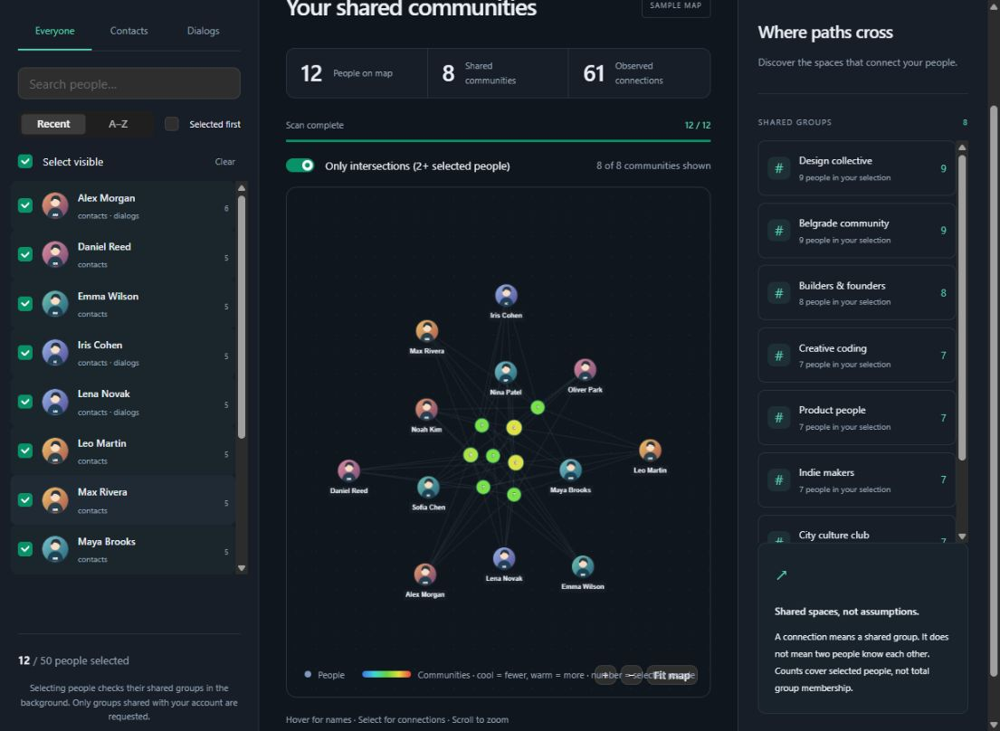
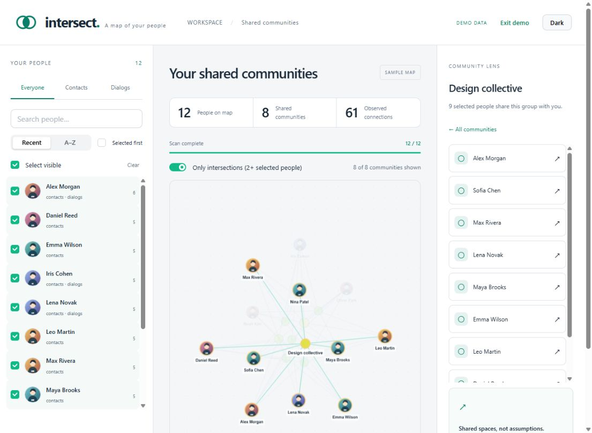

# Telegram Intersect

A private, self-hosted explorer for the connections between your Telegram contacts, conversations,
and communities.

Telegram Intersect turns observed person–community memberships into an interactive map with two
complementary perspectives. In **People** mode, select people from contacts or private dialogs to
find the communities connecting them. In **Communities** mode, select previously observed chats or
channels to see which people connect those spaces. Contacts and Dialogs are independent, persistent
sources, so the same map can focus on either catalog or their deduplicated union.

**[Explore the public synthetic demo](https://kreozot.github.io/telegram-intersect/)** — no Telegram
account or personal data required.

The application analyzes only chats shared with your signed-in account. Counts describe observed
memberships among the current selection, not complete community membership, and partial scans remain
clearly distinguished from confirmed results.

## Screenshots

Explore the synthetic demo without connecting a Telegram account. Switch between selecting people
and communities, inspect their overlaps, and focus any node to reveal its observed connections.



Select a community to focus its graph connections and see every selected person observed in it.



## Features

- Telegram QR or phone/code sign-in, including two-step verification.
- Persistent contact/dialog source controls, People/Communities map modes, search, activity/A–Z
  sorting, and bulk selection.
- Cache-first static profile avatars downloaded sequentially after catalog loading.
- Cache-first community avatars shown in the community lens and always visible in the graph.
- Cytoscape graph with neighborhood highlighting, zoom, fit, an animated full-screen view,
  community counts, and a keyboard-accessible details panel.
- Light and dark themes, plus a clearly labeled synthetic demo requiring no account.
- Adaptive concurrent scans with pagination, Telegram flood waits, cancellation, checkpoints, and
  resume after a restart.
- Local SQLite metadata storage and encrypted Telegram authorization sessions.
- Automatic owner access on loopback and access-key protection for hosted installations.

## Privacy: no conversation archive

Intersect does **not** request message history, search messages, download message attachments, send messages, or mark conversations as read. It downloads only small static profile thumbnails after catalog discovery. Application and protocol request logging are disabled.

Telegram's [dialog-list API](https://core.telegram.org/method/messages.getDialogs) includes top-message objects unavoidably. If you click **Load dialogs**, these are received transiently, reduced to pagination metadata, and discarded in the server adapter. Message content is never stored, logged, or sent to the browser. This behavior was explicitly approved by the owner. **Load contacts** does not make dialog-list requests.

The Telegram adapter has a method allowlist, disables the SDK's update synchronization and entity cache, and wraps application RPCs in invokeWithoutUpdates. It also discards unsolicited update payloads rather than retaining or processing them. The transport still performs required connection handshakes and keepalives. See [privacy and data handling](docs/privacy.md) for precise boundaries and retained fields.

Only chats [shared with your signed-in account](https://core.telegram.org/method/messages.getCommonChats) are visible. A missing edge in a partial scan is not proof of non-membership, and sharing a group does not prove that people know each other.

## Run locally

Prerequisites: **Node.js 24.x** and npm. Node's built-in SQLite API is used; other Node major versions are intentionally rejected by npm.

From this repository:

```sh
npm ci
npm run build
npm start
```

Open [http://127.0.0.1:4310](http://127.0.0.1:4310). One server serves both the UI and API. Without Telegram credentials you can immediately choose **Explore demo**.

Local loopback access is authorized automatically, so opening the application on this computer does
not require an access key. Host and origin checks still reject requests addressed through unrelated
origins. Keep `data/` accessible only to the owner; Windows permissions follow the parent directory's
ACL.

### Connect Telegram

1. Create your own Telegram application at [my.telegram.org/apps](https://my.telegram.org/apps) to obtain `api_id` and `api_hash`. These are user-client credentials, not a bot token.
2. Copy `.env.example` to `.env`.
3. Fill in `TELEGRAM_API_ID` and `TELEGRAM_API_HASH`, then restart the server.
4. Sign in with QR or phone/code. For QR, use Telegram → Settings → Devices → Link Desktop Device.
5. Load contacts, dialog identities, or both. Choose a source tab, search if needed, and use **Select visible** or individual checkboxes.
6. Shared-group counts are checked asynchronously after loading a source; select people and the map
   grows as results arrive.
   Select a community or graph node to inspect connections.

Loading contacts or dialogs adds those people to a sequential background scan after the catalog is
available, without delaying the catalog response. Selecting people can also add them to the same
queue. Reopening an authorized workspace resumes missing counts for the saved catalog without a
source reload. Until observations arrive, community/connection counts show **—** (unknown). A zero is
only confirmed after every selected person has completed scanning; partial scans may already show
observed connections. Completed observations are reused.

For two or more selected people, **Only intersections** initially shows groups observed for at least two of them. Turn it off to include groups observed for just one selected person. The displayed/total counter explains this filter; summary metrics always describe the full selection. People and groups appear as circular avatars, with group-border color indicating the observed selected-person count. Group markers enlarge slightly on hover or selection and show their names there; selecting a person highlights their connections. Full titles remain available in the details panel.

SMS delivery is not guaranteed for third-party clients. Telegram may deliver a code through an existing Telegram session. Unsupported email setup, CAPTCHA, registration, or other additional authorization challenges are reported as unsupported; try the QR flow for an existing account. Never paste Telegram secrets into issues or logs.

### Configuration

Values come from the process environment, then `.env`. Paths are resolved from the repository root.

| Variable | Default | Purpose |
| --- | --- | --- |
| TELEGRAM_API_ID / TELEGRAM_API_HASH | unset | Your Telegram client credentials |
| HOST | 127.0.0.1 | Listening interface |
| PORT | 4310 | UI/API port; 0 chooses an available port |
| MAX_SELECTED_PEOPLE | 50 | Maximum number of people selected at the same time |
| DATA_DIR | data | Private SQLite database and generated local keys |
| APP_ACCESS_KEY | unset locally; required when hosted | Hosted owner access; at least 24 random characters |
| SESSION_ENCRYPTION_KEY | generated local key | Exactly 64 hexadecimal characters for session encryption |
| PUBLIC_ORIGIN | unset | Exact HTTPS origin for hosted mode, with no trailing slash |

Local browser access survives restarts without an unlock step. In hosted mode, browser sessions last
12 hours, a restart invalidates them, and **Lock** ends the current session. The encrypted Telegram
session and scan checkpoints survive either way. **Disconnect Telegram** revokes this app's Telegram
session and deletes local account data. **Clear local data** deletes analysis data while retaining
Telegram authorization. Neither action deletes Telegram chats or contacts.

## Run with Docker

Docker Compose can build and run the production application without installing Node.js on the host:

```sh
docker compose up --build -d
```

Open [http://127.0.0.1:4310](http://127.0.0.1:4310). The application is published only on the host's
loopback interface, and its private database and generated session key are kept in the
`intersect-data` named volume. To connect Telegram, copy `.env.example` to `.env`, fill in
`TELEGRAM_API_ID` and `TELEGRAM_API_HASH`, and recreate the service. Set `INTERSECT_PORT` in `.env`
to use a different host port.

```sh
docker compose down
```

This stops and removes the container but preserves the named volume. Do not add `--volumes` unless
you intend to delete the local database, cached metadata, encrypted Telegram session, and generated
session key. Do not change the Compose port binding from `127.0.0.1` to a public interface; use the
protected hosted configuration below for remote access.

## Public synthetic demo

The GitHub Pages workflow publishes a browser-only synthetic demo after every push to `main`. Enable
it once in the GitHub repository under **Settings → Pages → Build and deployment → Source → GitHub
Actions**. The project site is then available at
[https://kreozot.github.io/telegram-intersect/](https://kreozot.github.io/telegram-intersect/).

The published artifact contains no server, database, Telegram credentials, authorization session,
or real contact data. It opens directly in demo mode and does not call the application API. To build
the same static artifact locally, run `npm run build:demo`; its files are written to `dist/web`.

## Development and debugging

```sh
npm ci
npm run dev
```

Open the same port, normally 4310. Vite runs as middleware on the server port and refreshes frontend changes. Restart the process after changing backend code or environment variables.

```sh
npm run debug
```

This starts development mode with the Node inspector bound to **127.0.0.1:9229**. Attach a Node debugger to port 9229; the repository includes a VS Code attach configuration. Set backend breakpoints under `src/server/`. For frontend breakpoints, use browser developer tools and the Vite source modules under `src/web/`.

Do not expose the inspector port publicly. Do not enable raw Telegram/debug payload logging or inspect/share real message payloads. Reproduce bugs with the synthetic demo or test fixtures whenever possible.

Quality checks:

```sh
npm run check
npm test
npm run build
```

Format supported source files with `npm run format`. Biome configuration is in the repository root,
and Stylelint configuration is in `stylelint.config.mjs`. Run `npm run lint:css` for a focused
stylesheet check. `npm install` also configures a pre-commit hook that runs both linters against
staged supported files. Tests use Node's runner and synthetic Telegram objects; they require no
account or network.

For a port conflict, stop the other instance or change PORT. If saved authorization cannot be restored, check connectivity and the original SESSION_ENCRYPTION_KEY, or sign in again. Do not replace the encryption key while expecting existing encrypted sessions to remain readable. If catalog loading fails, existing data is preserved. A flood wait must expire before retrying. If a scan was interrupted, use **Resume unfinished scan**.

## Hosting on a server

Use the same build/start commands with Node.js 24. Run exactly one application process per DATA_DIR; this release is not a multi-user service or a multi-process job system.

Set a long random APP_ACCESS_KEY, a persistent SESSION_ENCRYPTION_KEY, and PUBLIC_ORIGIN (for example `https://intersect.example.com`). Place an HTTPS reverse proxy in front of the process, preserve the original Host header, and forward to its private port. Keep the backend port inaccessible from the public network. To bind a non-loopback interface, HOST, PUBLIC_ORIGIN, and both keys must be explicitly configured; startup refuses an unprotected remote configuration. The proxy must support the expected request duration for catalog discovery.

Browser cookies are HttpOnly and SameSite=Strict, with Secure in hosted mode. API mutations require the application's request header; request host/origin checks reject unrelated origins. No CORS access is enabled.

Keep DATA_DIR and keys on private persistent storage. Stop the process before copying the database for backup; store backups securely and keep the encryption key separate from the database backup. Deleting local records does not erase old external backups. Full-disk encryption is recommended if metadata-at-rest confidentiality beyond filesystem permissions is needed; only Telegram session material is encrypted inside SQLite.

The provided Compose file is intentionally a local-only convenience configuration. A containerized
hosted deployment must remove `LOOPBACK_PROXY`, set `HOST=0.0.0.0`, provide `PUBLIC_ORIGIN`,
`APP_ACCESS_KEY`, and `SESSION_ENCRYPTION_KEY`, and expose the application only to its HTTPS reverse
proxy.

## API

[API documentation](docs/api.md) includes endpoint semantics and JavaScript, Python, and curl examples. Hosted clients use owner authorization and cookies; never embed access keys in URLs.

## Implementation and validation status

The application builds and runs locally. Automated checks cover identity deduplication, graph counts, privacy normalization, blocked Telegram operations, encryption, authorization boundaries, pagination, and cancellation/recovery. Browser checks cover the synthetic graph, details, selection, and themes.

The owner has confirmed QR login with two-step verification and contact loading. Phone/code login, live-account pagination, and remote HTTPS deployment remain unverified. See [development plan](docs/development-plan.md) for remaining release checks.

## Project documentation

- [Requirements](docs/requirements.md)
- [Development plan](docs/development-plan.md)
- [Architecture](docs/architecture.md)
- [Technology decisions](docs/decisions/0001-stack-proposal.md)
- [Implementation and privacy decisions](docs/decisions/0002-implementation-and-privacy.md)
- [Selection-triggered scan decision](docs/decisions/0004-selection-triggered-scans.md)
- [Catalog-triggered count decision](docs/decisions/0013-catalog-triggered-counts.md)
- [Adaptive scan and SSE decision](docs/decisions/0014-adaptive-scan-and-sse.md)
- [Configurable selection-limit decision](docs/decisions/0005-selection-limit.md)
- [Coding practices](docs/coding-practices.md)
- [Code style](docs/code-style.md)
- [Agent instructions](AGENTS.md)

Documentation, comments, commit messages, and pull requests are written in English.
